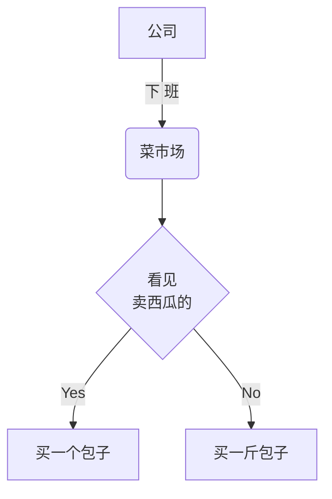

<div>

# 按钮 Button 
    
```
demo
color
size
```

<div style="background: red">
1232
<HelloWorld name="xx">
</HelloWorld>
</div>


 ## 表格
| 名称 | 类型 | 默认值 | 说明 |
| --- | --- | --- | --- |
| block | `boolean` | `false` | 按钮是否显示为块级 |

<HelloWorld>
</HelloWorld>
</div>

上下结构


